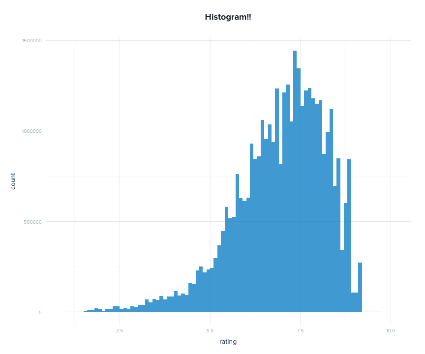
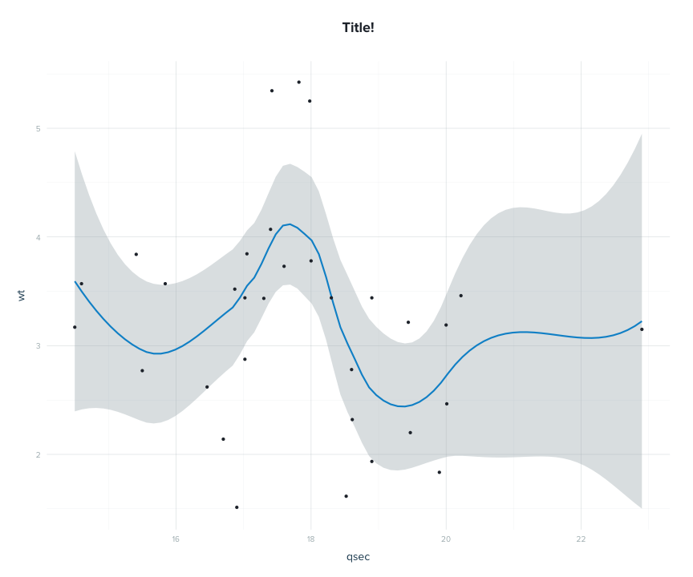
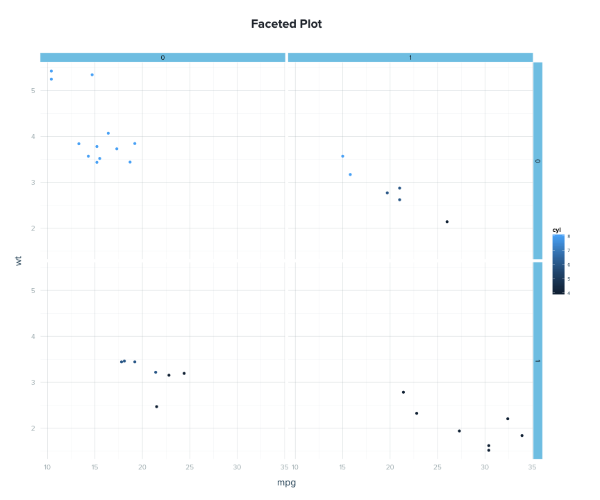
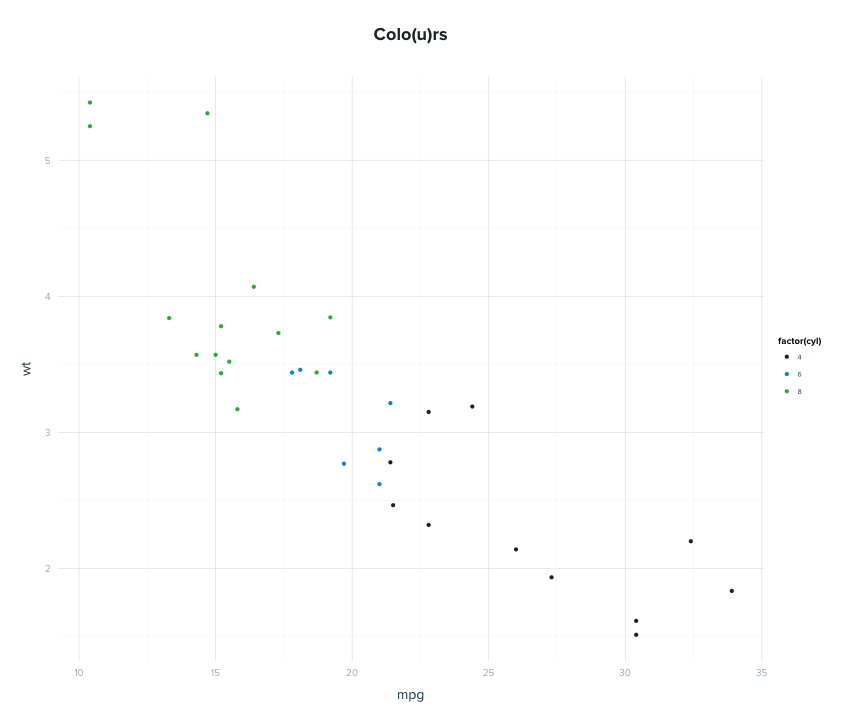

# Plots for Lytics

Plots can be styled using `lytrbox::set_lytics_theme()`.  This will load and apply the `lytrbox::lytics_theme` theme to all plots generated with `ggplot2`.


```r
library(ggplot2)
library(grid)
library(lytrbox)
set_lytics_theme()
```

## Histograms


```r
qplot(rating, data = movies, weight = votes, geom = "histogram", binwidth = 0.1, main = "Histogram!!")
```

 

## Scatterplots &amp; Smoothing


```r
smoothed <- ggplot(mtcars, aes(qsec, wt))
smoothed + stat_smooth(method = "loess", size = 1) + geom_point() + ggtitle("Title!")
```

 

## Faceting


```r
qplot(mpg, wt, data = mtcars, facets = vs ~ am, col = cyl, main = "Faceted Plot")
```

 

## Bar Charts

It'd be nice to set the defaults for the color scale without having to specify it per plot.


```r
values <- c(lytics_colors["darkblue"], lytics_colors["brightblue"],lytics_colors["brightgreen"],lytics_colors["gray"])
names(values) <- NULL
qplot(mpg, wt, data = mtcars, colour = factor(cyl), main = "Colo(u)rs") + scale_colour_manual(values = values)
```

 
